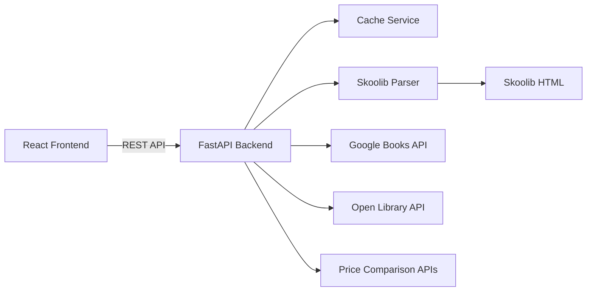

# CLAUDE.md

This file provides guidance to Claude Code (claude.ai/code) when working with code in this repository.

## Project Overview

Booktarr is a book library management system that imports books from Skoolib share links and displays them in a Sonarr-inspired interface with rich metadata and pricing information. The project evolves from a basic web UI to a mobile-capable progressive web app with barcode scanning functionality.
Always use the INTEGRATION_ROADMAP.md file to see what you should be doing, and where you should be going. Update that file as you go with errors, status, workaround, features, needed additions to complete the goal, etc.

## Tech Stack

### Backend
- **Framework**: FastAPI (Python 3.11+)
- **Key Dependencies**: httpx, Pydantic v2, beautifulsoup4, lxml
- **Testing**: pytest, pytest-asyncio, httpx (for test client)
- **Documentation**: Auto-generated OpenAPI/Swagger UI

### Frontend
- **Framework**: React 18 with TypeScript
- **Styling**: TailwindCSS (custom Sonarr-inspired dark theme)
- **HTTP Client**: Axios with interceptors for error handling
- **State Management**: React Context API (upgradeable to Redux if needed)
- **Testing**: Jest + React Testing Library
- **PWA**: Workbox for service workers

### Infrastructure
- **Containerization**: Docker Compose with multi-stage builds
- **Reverse Proxy**: Nginx for frontend serving
- **Development**: Hot-reload enabled for both services
- **Production**: Optimized builds with caching headers

## Common Development Commands

### Backend Development
```bash
cd backend
python -m venv venv
source venv/bin/activate  # On Windows: venv\Scripts\activate
pip install -r requirements.txt
pip install -r requirements-dev.txt  # Development dependencies

# Development server with auto-reload
uvicorn app.main:app --reload --host 0.0.0.0 --port 8000

# Run tests
pytest -v
pytest --cov=app  # With coverage report

# Format code
black app/
isort app/

# Type checking
mypy app/
```

### Frontend Development
```bash
cd frontend
npm install

# Development
npm start          # Development server on port 3000
npm run test       # Run test suite in watch mode
npm run test:ci    # Single test run for CI
npm run lint       # ESLint checking
npm run format     # Prettier formatting

# Production
npm run build      # Production build
npm run analyze    # Bundle size analysis
npm run serve      # Serve production build locally
```

### Full Stack Development
```bash
# Development mode with hot-reload
docker-compose -f docker-compose.yml -f docker-compose.dev.yml up

# Production mode
docker-compose up --build -d

# Utility commands
docker-compose logs -f [service_name]  # View logs
docker-compose exec backend pytest      # Run backend tests
docker-compose down -v                  # Stop and remove volumes
```

## Architecture Overview

### Service Communication Flow


### Key API Endpoints

#### Book Management
- `GET /api/books` - Returns books grouped by series with enriched metadata
- `GET /api/books/{isbn}` - Get specific book details
- `POST /api/books/scan` - Add book via ISBN (Phase 4)
- `DELETE /api/books/{isbn}` - Remove book from library

#### Settings & Configuration
- `GET /api/settings` - Retrieve current settings
- `PUT /api/settings` - Update settings (including Skoolib URL)
- `POST /api/settings/validate` - Test Skoolib URL validity

#### System
- `GET /health` - Health check endpoint
- `GET /api/docs` - OpenAPI documentation
- `GET /api/stats` - Library statistics

### Data Models

#### Book Model
```python
class Book(BaseModel):
    isbn: str
    title: str
    authors: List[str]
    series: Optional[str]
    series_position: Optional[int]
    publisher: Optional[str]
    published_date: Optional[date]
    page_count: Optional[int]
    language: str = "en"
    thumbnail_url: Optional[HttpUrl]
    description: Optional[str]
    categories: List[str] = []
    pricing: List[PriceInfo] = []
    metadata_source: str  # "skoolib", "google_books", "open_library"
    added_date: datetime
    last_updated: datetime
```

#### Response Structure
```python
{
    "series": {
        "Standalone": [...],     # Books without series
        "Harry Potter": [...],   # Books in Harry Potter series
        "Discworld": [...]       # Books in Discworld series
    },
    "total_books": 150,
    "total_series": 25,
    "last_sync": "2024-01-20T10:30:00Z"
}
```

### Frontend Architecture

#### Component Hierarchy
```
App
├── Layout
│   ├── Header (with search)
│   ├── Sidebar (navigation)
│   └── MainContent
├── Pages
│   ├── Library
│   │   ├── SearchBar
│   │   ├── FilterPanel
│   │   └── BookGrid
│   │       ├── SeriesGroup
│   │       └── BookCard
│   ├── Settings
│   │   ├── SkoolibConfig
│   │   └── ThemeSettings
│   └── Scanner (Phase 4)
└── Common
    ├── LoadingSpinner
    ├── ErrorBoundary
    └── Toast
```

#### State Management
```typescript
interface AppState {
    books: BooksBySeriesMap;
    settings: AppSettings;
    ui: {
        loading: boolean;
        error: string | null;
        filters: FilterState;
        viewMode: 'grid' | 'list';
    };
}
```

### Caching Strategy

#### Backend Caching
- **In-Memory Cache**: LRU cache with configurable TTL
- **Cache Keys**: Based on ISBN for individual books, URL hash for Skoolib pages
- **Cache Invalidation**: Manual refresh option + automatic TTL expiry
- **Cache Warming**: Background task to pre-fetch popular books

#### Frontend Caching
- **Browser Storage**: IndexedDB for offline book data
- **Service Worker**: Cache API responses for offline access
- **Image Caching**: Progressive loading with lazy loading

### External API Integration

#### Integration Priority
1. **Skoolib**: Primary source for user's book collection
2. **Google Books API**: Rich metadata (no key required for basic access)
3. **Open Library API**: Fallback for missing metadata
4. **Price APIs**: Multiple sources for price comparison

#### Rate Limiting Strategy
```python
RATE_LIMITS = {
    "google_books": {"calls": 1000, "period": "day"},
    "open_library": {"calls": 100, "period": "hour"},
    "price_api": {"calls": 50, "period": "minute"}
}
```

## UI/UX Design Guidelines

### Color Scheme
```css
:root {
    /* Dark Theme Base */
    --bg-primary: #0a0a0a;
    --bg-secondary: #161616;
    --bg-tertiary: #1f1f1f;
    
    /* Purple Accent Colors */
    --purple-50: #faf5ff;
    --purple-100: #f3e8ff;
    --purple-200: #e9d5ff;
    --purple-300: #d8b4fe;
    --purple-400: #c084fc;
    --purple-500: #a855f7;  /* Primary purple */
    --purple-600: #9333ea;
    --purple-700: #7e22ce;
    --purple-800: #6b21a8;
    --purple-900: #581c87;
    
    /* Status Colors */
    --success: #10b981;
    --warning: #f59e0b;
    --error: #ef4444;
    --info: #3b82f6;
}
```

### Responsive Breakpoints
- Mobile: < 640px
- Tablet: 640px - 1024px
- Desktop: > 1024px

### Accessibility Requirements
- WCAG 2.1 AA compliance
- Keyboard navigation support
- Screen reader announcements
- Color contrast ratio ≥ 4.5:1

## Configuration & Environment

### Environment Variables

#### Backend (.env)
```bash
# Application
APP_NAME=Booktarr
APP_VERSION=1.0.0
DEBUG=false
LOG_LEVEL=INFO

# API Configuration
API_PREFIX=/api
CORS_ORIGINS=["http://localhost:3000"]

# Cache Configuration
CACHE_TTL=3600  # seconds
CACHE_MAX_SIZE=1000

# External APIs (optional)
GOOGLE_BOOKS_API_KEY=  # Optional for higher rate limits
```

#### Frontend (.env)
```bash
REACT_APP_API_URL=http://localhost:8000
REACT_APP_VERSION=$npm_package_version
REACT_APP_ENABLE_PWA=true
REACT_APP_ENABLE_ANALYTICS=false
```

### Docker Configuration

#### Network Architecture
```yaml
networks:
  booktarr-net:
    driver: bridge
    ipam:
      config:
        - subnet: 172.20.0.0/16
```

#### Health Checks
```yaml
healthcheck:
  test: ["CMD", "curl", "-f", "http://localhost/health"]
  interval: 30s
  timeout: 10s
  retries: 3
  start_period: 40s
```

## Error Handling Patterns

### Backend Error Handling
```python
class BooktarrException(Exception):
    """Base exception for all Booktarr errors"""
    
class SkoolibParsingError(BooktarrException):
    """Failed to parse Skoolib HTML"""
    
class ExternalAPIError(BooktarrException):
    """External API request failed"""
    
class ValidationError(BooktarrException):
    """Input validation failed"""
```

### Frontend Error Boundaries
```typescript
interface ErrorState {
    hasError: boolean;
    error: Error | null;
    errorInfo: ErrorInfo | null;
}

// Global error handler
window.addEventListener('unhandledrejection', (event) => {
    logError(event.reason);
    showToast('An unexpected error occurred', 'error');
});
```

## Testing Strategy

### Backend Testing
- **Unit Tests**: Test individual functions and methods
- **Integration Tests**: Test API endpoints with mocked external services
- **E2E Tests**: Test full flow from Skoolib parsing to API response

### Frontend Testing
- **Component Tests**: Test individual React components
- **Integration Tests**: Test component interactions
- **E2E Tests**: Cypress for full user flows

### Test Coverage Requirements
- Backend: Minimum 80% coverage
- Frontend: Minimum 70% coverage
- Critical paths: 100% coverage

## Performance Optimization

### Backend Optimizations
- Async/await for all I/O operations
- Connection pooling for external APIs
- Batch processing for multiple ISBNs
- Gzip compression for responses

### Frontend Optimizations
- Code splitting with React.lazy()
- Image lazy loading with Intersection Observer
- Virtual scrolling for large book lists
- Memoization for expensive computations

## Security Considerations

### API Security
- Input validation on all endpoints
- Rate limiting per IP
- CORS properly configured
- No sensitive data in logs

### Frontend Security
- Content Security Policy headers
- XSS protection
- HTTPS only in production
- Sanitize user inputs

## Troubleshooting Guide

### Common Issues

#### Backend
1. **Skoolib parsing fails**: Check HTML structure hasn't changed
2. **External API timeout**: Increase timeout values or implement retry
3. **Cache memory issues**: Reduce cache size or implement Redis

#### Frontend
1. **Build fails**: Clear node_modules and package-lock.json
2. **CORS errors**: Verify backend CORS configuration
3. **PWA not updating**: Check service worker cache strategy

## Development Best Practices

### Code Style
- Python: Follow PEP 8, use Black formatter
- TypeScript: Follow Airbnb style guide
- Commits: Use conventional commits format

### Git Workflow
```bash
# Feature development
git checkout -b feature/description
# Make changes
git commit -m "feat: add new feature"
git push origin feature/description
# Create pull request
```

### PR Requirements
- All tests passing
- Code coverage maintained
- Documentation updated
- Reviewed by at least one team member